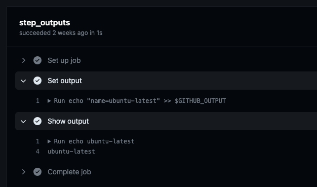
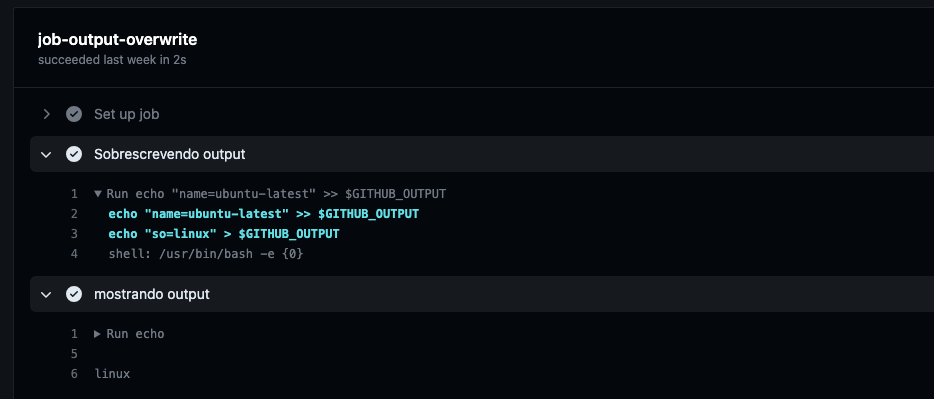
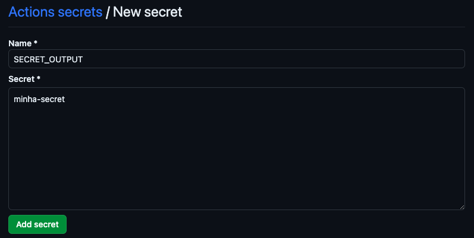
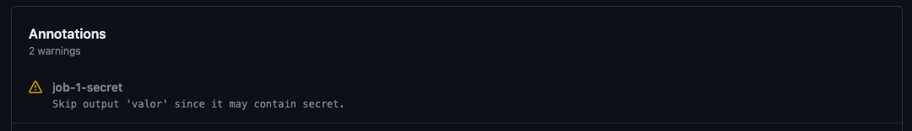
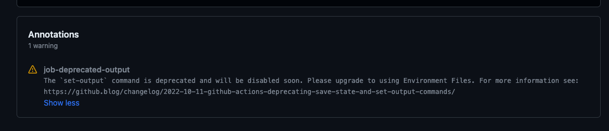

# Utilizando Github Actions output

## Introdução

Conforme os workflows são construidos e vão se tornando mais complexos, há a necessidade de compartilhar informações entre *steps*, jobs e até mesmo workflows. Uma das formas mais comuns de compartilhar dados é utilizando Github outputs, devido a sua simplicidade e por ser um recurso nativo dos workflows.

Esse material tem como intuito explorar a utilização dos outputs, suas limitações e melhores práticas de uso. Por mais que seja simples devemos tomar cuidado em alguns pontos.

## *Output* entre *steps*

A sintaxe para gerar um output segue o seguinte padrão:

`echo "<nome_do_output>=<valor_do_output>" >> $GITHUB_OUTPUT`

Um dos exemplos mais simples é o compartilhamento entre *steps* do mesmo job.

https://github.com/DevCombOps/medium-example/blob/5ca058c058a1dfb29e367c46fef8fca0ea15e1ae/.github/workflows/output.yml#L1-L14

No exemplo acima temos dois *steps*, o primeiro step gera o output e o segundo consome. O primeiro step tem o atributo `id` com o valor `runner`, dessa forma qualquer outro step dentro desse job consegue consumir o output gerado. Podemos ver o consumo do output no segundo step com a seguinte sintaxe:

`${{ steps.<id_da_step_anterior>.outputs.<nome_do_output> }}`

O resultado do workflow criado será a exibição do runner name.

## *Output* entre jobs

Para compartilhar output entre jobs é necessário adicionar a propriedade output no *job* que irá gerar o valor, contendo a referência do step (conforme descrito acima) e no *job* quer irá receber o valor deverá conter a propriedade *needs* com o nome do job anterior. Para ficar mais claro vamos olhar o seguinte exemplo:

https://github.com/DevCombOps/medium-example/blob/5ca058c058a1dfb29e367c46fef8fca0ea15e1ae/.github/workflows/output.yml#L16-L32

## *Output* com actions/core

Além da sintaxe descrita anteriormente há como utilizar output através da action [github-script](https://github.com/actions/github-script). Essa action é muito utilizado quando é necessário fazer alguma integração com o Github. Abordaremos essa action e outro tópico.

https://github.com/DevCombOps/medium-example/blob/0a22cdd70b304a8a4d62fadfa46381b9c65f3218/.github/workflows/output.yml#L34-L45

## O que não deve ser feito

### Sobrescrever variável GITHUB_OUTPUT

Um erro comum que devemos ficar atento é a sobrescrita da variável `GITHUB_OUTPUT` dentro do mesmo step. Caso isso aconteça, todos os outputs salvos anteriormente serão perdidos.

https://github.com/DevCombOps/medium-example/blob/0a22cdd70b304a8a4d62fadfa46381b9c65f3218/.github/workflows/output.yml#L47-L58

Isso acontece pois a variável `GITHUB_OUTPUT` possui um arquivo como referência. Assim como temos o arquivo `/etc/environment` o arquivo do `GITHUB_OUTPUT` é carregado a toda nova step.

### Compartilhar secrets

Valores cadastrados em secret não podem ser compartilhados como output entre jobs. Vamos supor que haja uma secret com o valor `minha-secret`. Para cadastrar uma secret basta seguir o caminho `Settings > Secrets and variables > Actions > New repository secret`.

Agora vamos atribuir a secret a um output.

https://github.com/DevCombOps/medium-example/blob/0a22cdd70b304a8a4d62fadfa46381b9c65f3218/.github/workflows/output.yml#L60-L68

Ao executar o workflow vamos receber o seguinte warning.

### *Output* deprecated

A sintaxe descrita abaixo funciona, porém está depreciada e não deve ser utilizada, pois não sabemos quando deixará de funcionar.

https://github.com/DevCombOps/medium-example/blob/0a22cdd70b304a8a4d62fadfa46381b9c65f3218/.github/workflows/output.yml#L78-L85

Ao executar é possível ver o seguinte warning.

